# AWBW Map Generator

**Local AI map generation for Advance Wars By Web.** Get a starting layout, explore variations, or let the AI complete part of a map you have already started. Give it a prompt in the left sidebar, generate a draft, then keep and refine the parts you like in the familiar map editor.

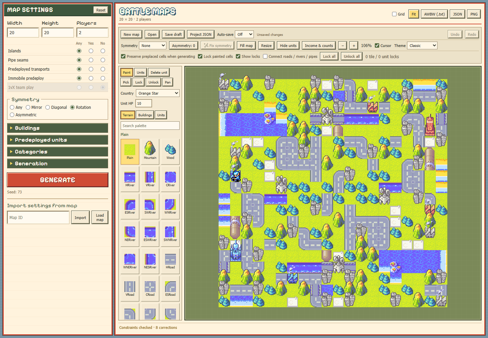

## Your computer does the generation

The included **PPO 48000** model runs on your PC. **Your settings, maps and locked cells are not sent to OpenAI or another AI provider.** No account, API key, subscription or per-generation fee is needed. The model is already trained; using the tool does not train it on your drafts.

**Generation and inpainting work offline after installation.** Internet is used for setup downloads and public AWBW map lookups through **Import / Load map**. Saving and exporting are local. The tool does not upload your drafts to AWBW; you choose what to share.

## Output examples

<table>
<tr>
<td width="33%">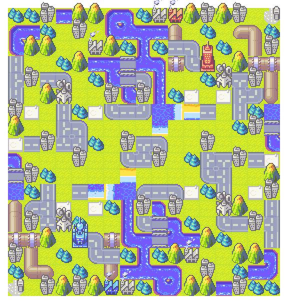</td>
<td width="33%">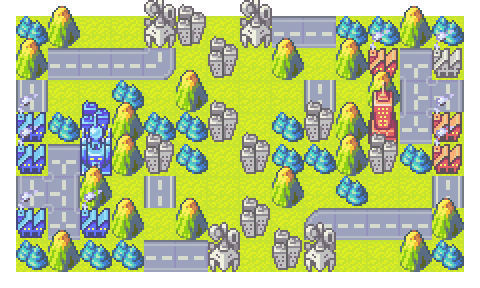</td>
<td width="33%">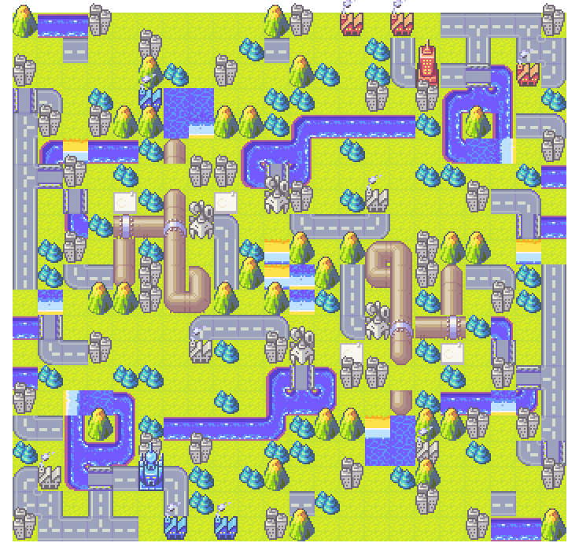</td>
</tr>
<tr>
<td width="33%">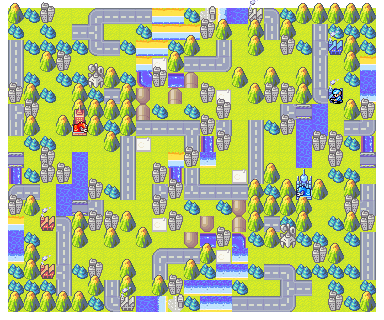</td>
<td width="33%">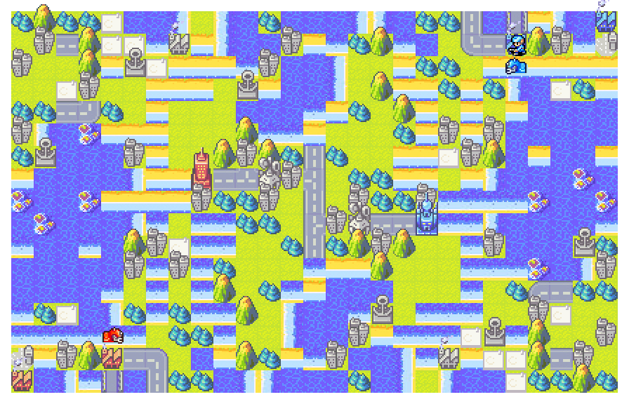</td>
<td width="33%">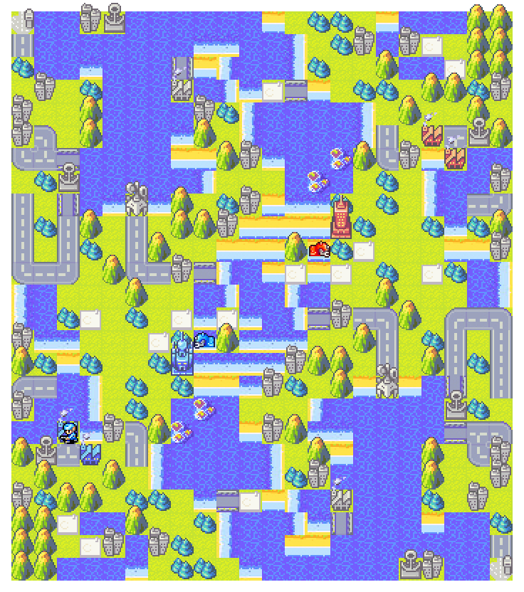</td>
</tr>
<tr>
<td width="33%">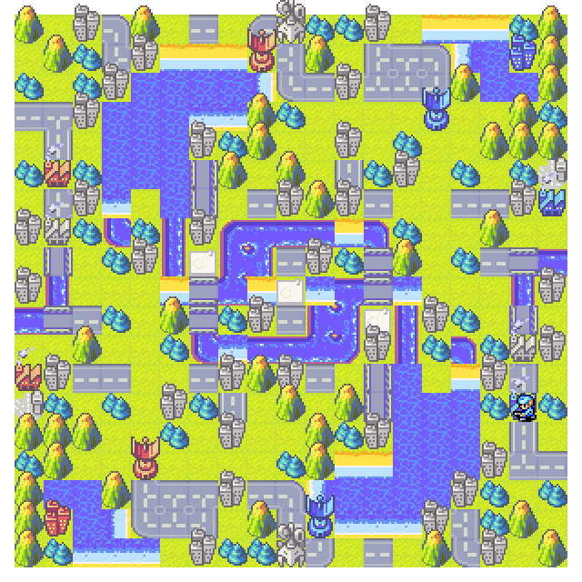</td>
<td width="33%">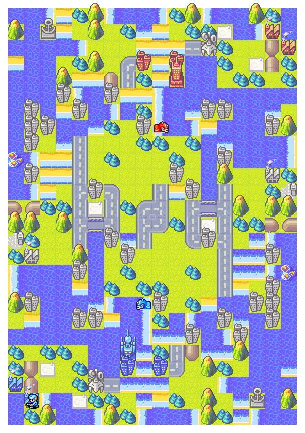</td>
<td width="33%">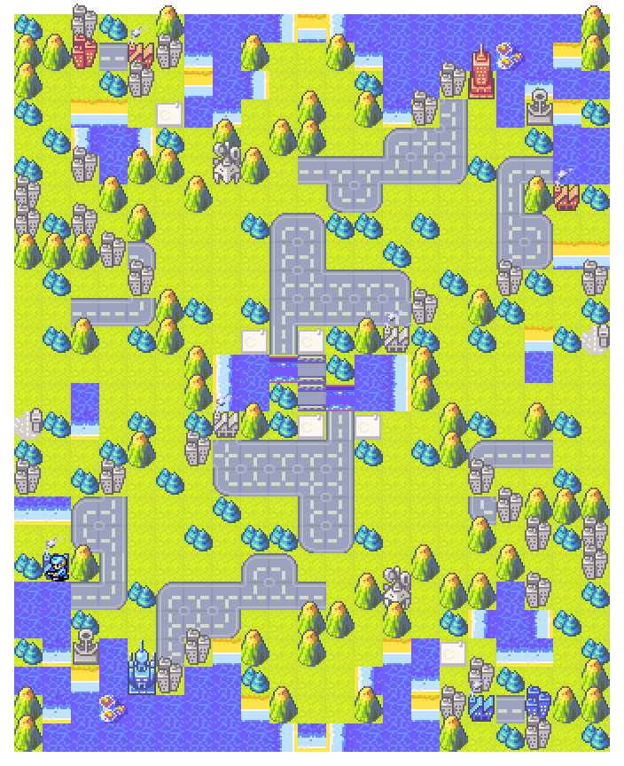</td>
</tr>
<tr>
<td width="33%">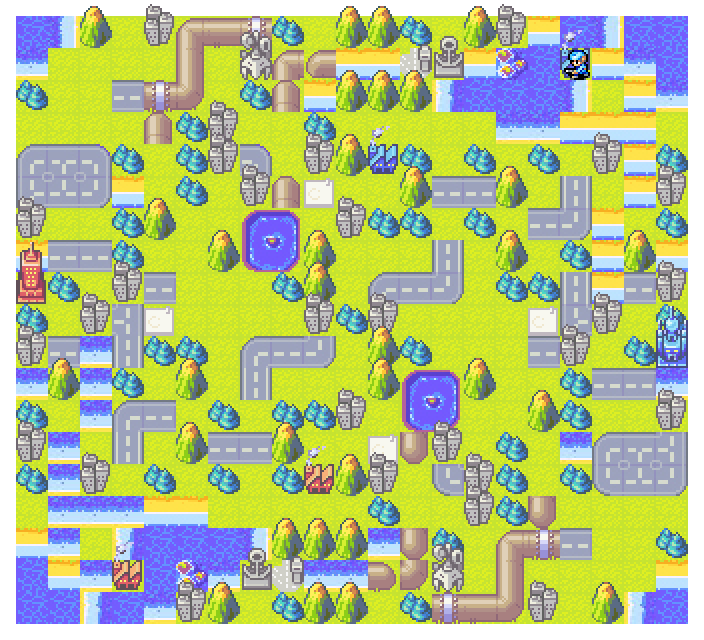</td>
<td width="33%">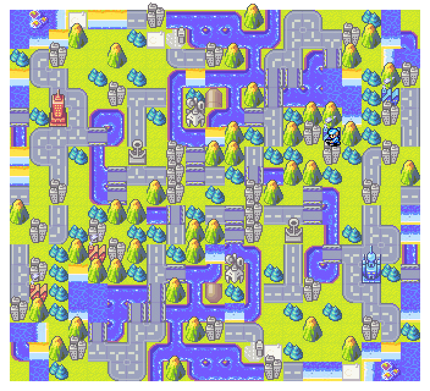</td>
<td width="33%">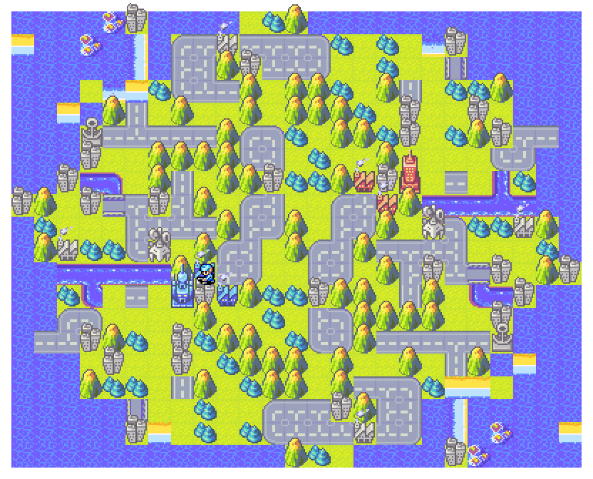</td>
</tr>
</table>

## Install on Windows

You need **64-bit Windows**, **Python 3.12**, and a browser. The standard installer uses your CPU, so a dedicated graphics card is optional.

1. Install **Python 3.12** from [python.org](https://www.python.org/downloads/windows/). Choose **Windows installer (64-bit)** and tick **Add python.exe to PATH** if the installer offers it.
2. On this project's GitHub page, click **Code → Download ZIP**. Right-click the ZIP and choose **Extract All**, then open the extracted folder. The model is already included.
3. Double-click **`Install.bat`**. Stay connected to internet and wait for **Installation complete**. Dependencies go into a private project folder.
4. Double-click **`Start.bat`**. Keep its terminal window open while using the generator. If the browser does not open, visit [http://127.0.0.1:8776](http://127.0.0.1:8776).

Next time, just run **`Start.bat`**. Close its terminal window or press **Ctrl+C** there to stop the program.

## Give the AI a prompt

Generative AI proposes layouts from learned patterns. Settings guide it toward your prompt; success and balance are not guaranteed. **Auto-correction** helps meet structural requests, and the result is checked afterwards. Conflicting or difficult requests can still fail.

Start with **20 × 20**, **2 players**, and **Rotation**, then click **Generate**. Add more specific requests once you have a useful starting point. Generate again to explore another draft.

For a map without starting units, set every **Predeployed units** count to **0**. Leaving a type blank gives the AI permission to add some.

### The left sidebar

**Blank / Any** leaves a choice open. **Yes** requests a feature; **No** asks to avoid it. **0** requests none. Blank and zero mean different things.

| Setting | What it asks for |
| --- | --- |
| **Width / Height** | Map size, up to **50 × 50** for generation and inpainting. Leave blank to let the model choose. |
| **Players** | The number of active player starts. |
| **Symmetry** | Mirror, diagonal, rotation or asymmetric terrain. Diagonal maps must be square. The editor's separate Symmetry dropdown controls your brush. |
| **Buildings** | **Total**, already **Owned**, or **Neutral** counts across the **whole map**. Bases → Owned = 4 means four pre-owned bases total. Proven unreachable neutral decoration is excluded. |
| **Predeployed units** | Starting-unit counts for the whole map. All unit types default to **0**. The screenshot uses Infantry = **1**, all others = **0**. Blank lets the model choose. |
| **Categories** | Familiar AWBW labels guiding the style. “Standard” and “S-Rank” are preferences; they cannot be certified or awarded by the tool. |

### The additional map tags

These describe map structure and starting-unit situations beyond the usual AWBW category labels. Each has **Any / Yes / No** choices.

| Tag | What it means |
| --- | --- |
| **Islands** | Capturable properties separated from the starting land areas by sea, with a usable capture/transport route. Decorative islands with nothing to capture do not count. |
| **Pipe seams** | At least one intact, breakable pipe seam. Ordinary pipes alone do not satisfy this tag. |
| **Predeployed transports** | Usable starting **T-Copters, Landers or Black Boats**. Naval transports need an adjacent sea or shoal exit. APCs are outside this tag. |
| **Immobile predeploy** | At least one starting unit has no adjacent terrain tile it can move onto. This checks terrain movement, not fuel or blockage by other units. |
| **1vX team play** | At least three players, with one starting-property setup differing from a similar group of others. An asymmetric-start heuristic; it does not assign teams or certify balance. |

Tags and counts should agree: requesting predeployed transports while setting all three transport types to zero creates a conflict. Relax one request and retry.

### Read the result message

- **Constraints met:** the requested structural checks passed. Still review and playtest the layout for balance.
- **Constraints checked:** some requests cannot be certified, such as an editorial category. Read the details below the map.
- **Constraints not met:** one or more requests were missed. Try another draft, change the settings, or edit the result.

A correction count reports automatic adjustments; it is not a quality score.

## The Generation panel

Open **Generation** in the sidebar. The included model is already selected. Start with **Temperature 1**, **Guidance 1**, **Random seed**, **Max attempts 4**, and **Auto-correction on**.

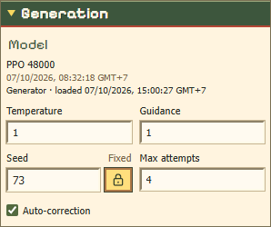

| Control | What it means |
| --- | --- |
| **Temperature** | The variety dial: lower favors likely choices; higher explores less likely ones. Start at **1**; try **0.8** for conservative drafts or **1.2** for variety. Higher does not mean better. |
| **Guidance** | How strongly the AI leans toward your settings. Start at **1**; try **1.5–2** if it drifts from your prompt. Stronger guidance can reduce variety; it still does not guarantee compliance. |
| **Seed** | The random starting-point number. Use **Random** to explore; click the dice/lock button for **Fixed** to revisit that starting point. Changing settings can change the result. |
| **Max attempts** | Up to this many candidates are tried per click; the best match to the checks is returned, with early stopping possible. **4** is a good default. More attempts cost time, not a smarter model or a balance guarantee. |
| **Auto-correction** | Adjusts counts, ownership and placements after the AI draft, and rotates or mirrors directional tiles to match the requested symmetry. Locked tiles stay unchanged; conflicting locks or unavailable tile variants are reported. Leave **on** for normal use. Turn off to inspect a less corrected draft that may need manual fixes. |

Change one control at a time to see its effect. Larger maps and more attempts take longer, especially on the CPU.

## Import an existing AWBW map

Enter its **map ID** below Generate. The two buttons do different jobs:

| Button | What you get | Useful for |
| --- | --- | --- |
| **Import** | Copies size, players, tags, building/unit counts and categories into the sidebar; keeps the current canvas. | A new AI layout with a similar prompt. |
| **Load map** | Opens the actual map in the editor; does not copy all generation preferences. | Editing it or keeping parts for inpainting. |

Use both if you want **the existing map and its settings** as your starting point. Lookups download the public map from AWBW when it is not already cached locally; they do not send AWBW your generated draft.

## Inpainting: keep some cells, regenerate the rest

“Inpainting” means completing or reworking a map around parts you choose to preserve. Keep your HQs and central river, for example, while the AI proposes the surrounding terrain and properties.

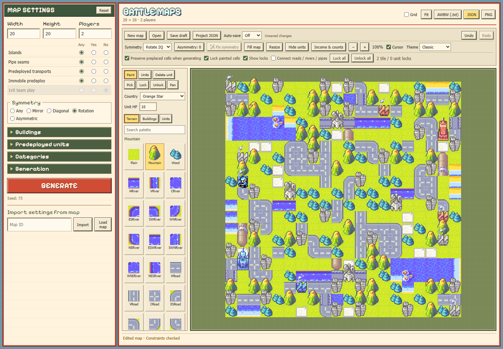

1. Start from a generated map, **Load map**, or paint the key cells yourself.
2. Select **Lock** and click or drag over cells to keep. **Unlock** makes selected cells available for regeneration again. Gold markers show locks when **Show locks** is enabled.
3. Keep **Preserve preplaced cells when generating** checked, choose your AI settings, and click **Generate**. The model uses locked cells as context and fills or redesigns the unlocked parts.

**Lock painted cells** protects manual edits by default. To redo only a small area, **Lock all**, then **Unlock** that area. **Unlock all** frees the whole map. Switching off **Preserve preplaced cells** ignores the locks during generation.

Locked buildings and units count toward requested totals. If what you keep contradicts a setting, unlock those cells or revise the request. **Project JSON** saves the map together with its locks for later.

## Export your result

**AWBW (.txt)** saves terrain and buildings for [AWBW Upload Map](https://awbw.amarriner.com/uploadmap.php); add predeployed units in AWBW afterwards. **JSON** keeps the map and units. **PNG** saves a shareable image. **Project JSON** also keeps editor locks and preferences.

## Setup help

- **Python not found:** install Python 3.12, then run `Install.bat` again.
- **Installation fails:** check your internet connection and the error in the installer window, then retry.
- **Model missing:** extract the complete project again and check for `models/ppo-48000.pt`.
- **Page will not open:** keep `Start.bat` running, close any older generator instance, and open `http://127.0.0.1:8776` manually.

## Model and license

The included **19.1 MB PPO 48000** checkpoint keeps the original FP32 weights. Training-only state was removed; exact weight equality and generation checks are recorded in `models/ppo-48000.verification.json`.

Application code and model weights use the [MIT license](LICENSE). Artwork and fonts have separate rights; see [Third-party notices](THIRD_PARTY_NOTICES.md). This is an unofficial Advance Wars fan project.

## Responsible use

AWBW players and the Map Committee (MC) have expressed disapproval of AI-generated or botted mapmaking, especially mass uploads of low-quality maps. These uploads are likely to be ignored and may lead to moderator action.

Use this tool to explore ideas, then review, edit and playtest each map before sharing it. **Do not spam AWBW's servers with unreviewed AI output.** Be selective about what you upload: quality matters more than quantity.
